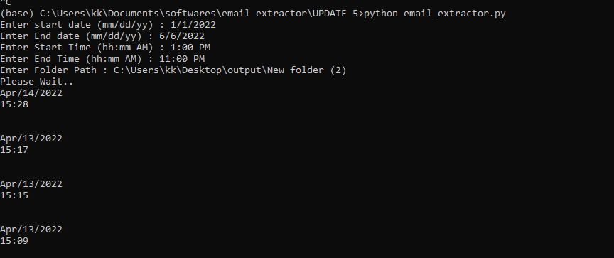

# Email-Extractor-Bot-Python
Bulk email extraction bot written in python.
It's a Command line interface (CLI) bot

# Installation
Install Python 3 in your PC.
then type these commands in windows command prompt.
pip3 install imaplib

# To Run

Just run email_extractor.py

